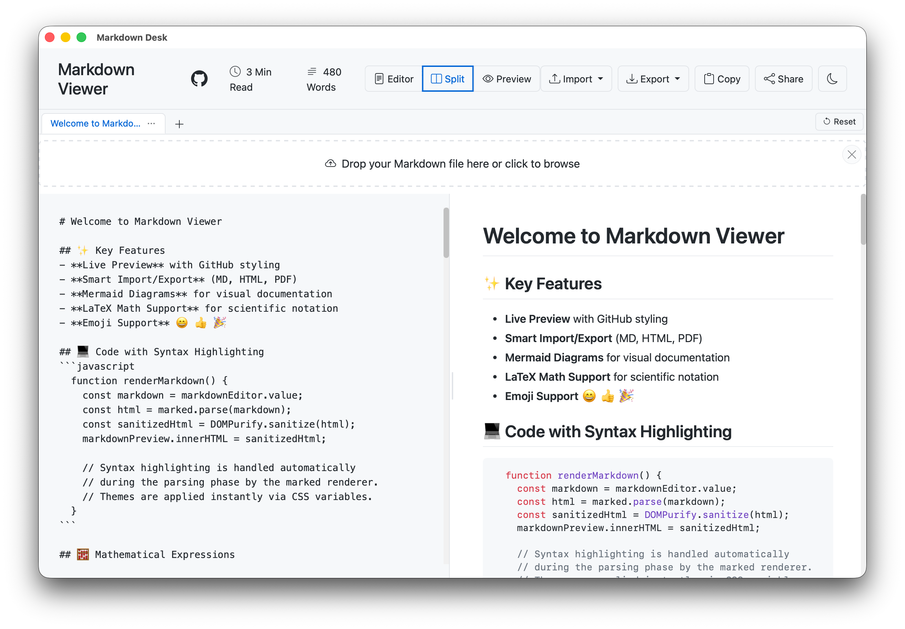

# Markdown Desk



[한국어](#한국어) | [English](#english)

---

## 한국어

[Markdown Viewer](https://github.com/ThisIs-Developer/Markdown-Viewer)의 모든 기능을 macOS 네이티브 데스크톱 앱으로 제공합니다.

### ✨ 추가 기능

- **파일 변경 감시(Live Reload)** — 열린 파일이 외부 편집기에서 수정되면 자동으로 내용이 갱신됩니다.
- **네이티브 파일 열기/저장/찾기** — `Cmd+O`로 파일 열기, `Cmd+S`로 저장, `Cmd+F`로 텍스트 찾기.
- **원본 추적** — Markdown Viewer 원본 소스를 Git 서브모듈로 추적하며, 업스트림 업데이트를 반영합니다.
- **텍스트 찾기** — `Cmd+F`로 프리뷰 영역에서 텍스트를 검색하고, `Enter`/`Shift+Enter`로 이동할 수 있습니다.
- **자동 업데이트** — 앱 시작 시 새 버전을 확인하고, 메뉴에서 수동 확인도 가능합니다.

### 📦 설치

1. [Releases](https://github.com/jhrepo/markdown-desk/releases)에서 최신 `.dmg` 파일 다운로드
2. 다운로드된 파일을 열고 Markdown Desk.app 을 Applications 폴더로 이동

### 🔓 처음 실행
macOS는 App Store 외부에서 다운로드한 앱을 차단할 수 있습니다.  
아래 중 하나로 해결하세요.

**방법 A.** Terminal에서 실행:
```bash
xattr -rd com.apple.quarantine /Applications/Markdown\ Desk.app
```

**방법 B.** 앱 아이콘 **우클릭 → 열기** 선택 후 팝업에서 "열기" 클릭

### 📂 기본 앱으로 설정

`.md` 파일을 더블클릭하면 Markdown Desk로 열리도록 설정할 수 있습니다.

1. `.md` 파일을 우클릭 → **정보 가져오기**
2. **다음으로 열기** 섹션에서 **Markdown Desk** 선택
3. **모두 변경...** 클릭

### 🔑 사용 방법

| 단축키 | 동작 |
|--------|------|
| `Cmd+O` | 마크다운 파일 열기 |
| `Cmd+S` | 원본 파일에 저장 |
| `Cmd+F` | 프리뷰에서 텍스트 찾기 |

파일을 열면 외부 편집기에서 수정 시 자동으로 내용이 갱신됩니다.

### 🤝 함께 만들어요

누구나 참여할 수 있습니다! 개선 아이디어나 버그 제보 모두 환영합니다.

1. 이 프로젝트를 Fork 합니다
2. 새 브랜치를 만듭니다 (`git checkout -b amazing-feature`)
3. 수정 내용을 커밋합니다 (`git commit -m 'Add some amazing feature'`)
4. 브랜치에 올립니다 (`git push origin amazing-feature`)
5. Pull Request를 보내주세요

### 📄 라이선스

이 프로젝트는 [MIT License](LICENSE)로 배포됩니다.

웹 프론트엔드는 [ThisIs-Developer](https://github.com/ThisIs-Developer)의
[Markdown Viewer](https://github.com/ThisIs-Developer/Markdown-Viewer)를 기반으로 하며,
동일하게 [MIT License](https://github.com/ThisIs-Developer/Markdown-Viewer/blob/main/LICENSE)로 배포됩니다.

macOS 데스크톱 래퍼는 [Tauri](https://tauri.app/)로 제작되었습니다.

---

## English

A native macOS desktop app that provides all features of [Markdown Viewer](https://github.com/ThisIs-Developer/Markdown-Viewer).

### ✨ Additional Features

- **Live Reload** — Automatically refreshes when an open file is modified by an external editor.
- **Native File Open/Save/Find** — `Cmd+O` to open, `Cmd+S` to save, `Cmd+F` to find text.
- **Tracks Upstream** — Includes the original Markdown Viewer source as a Git submodule and periodically merges upstream updates.
- **Find in Page** — `Cmd+F` to search text in the preview pane, navigate with `Enter`/`Shift+Enter`.
- **Auto Update** — Checks for new versions on startup, with manual check available from the menu.

### 📦 Install

1. Download the latest `.dmg` from [Releases](https://github.com/jhrepo/markdown-desk/releases)
2. Open the downloaded file and drag Markdown Desk.app to the Applications folder

### 🔓 First Launch
macOS may block apps downloaded outside the App Store.
Use one of the following to resolve:

**Option A.** Run in Terminal:
```bash
xattr -rd com.apple.quarantine /Applications/Markdown\ Desk.app
```

**Option B.** Right-click the app icon → **Open**, then click "Open" in the popup

### 📂 Set as Default App

Set Markdown Desk to open `.md` files by double-click:

1. Right-click a `.md` file → **Get Info**
2. Under **Open with**, select **Markdown Desk**
3. Click **Change All...**

### 🔑 Usage

| Shortcut | Action |
|----------|--------|
| `Cmd+O` | Open markdown file |
| `Cmd+S` | Save to original file |
| `Cmd+F` | Find text in preview |

Opened files are automatically refreshed when modified by an external editor.

### 🤝 Contributing

Everyone is welcome! Bug reports and feature ideas are all appreciated.

1. Fork this project
2. Create a new branch (`git checkout -b amazing-feature`)
3. Commit your changes (`git commit -m 'Add some amazing feature'`)
4. Push to the branch (`git push origin amazing-feature`)
5. Open a Pull Request

### 📄 License

This project is licensed under the [MIT License](LICENSE).

The web frontend is based on
[Markdown Viewer](https://github.com/ThisIs-Developer/Markdown-Viewer)
by [ThisIs-Developer](https://github.com/ThisIs-Developer),
also licensed under the [MIT License](https://github.com/ThisIs-Developer/Markdown-Viewer/blob/main/LICENSE).

The macOS desktop wrapper is built with [Tauri](https://tauri.app/).
